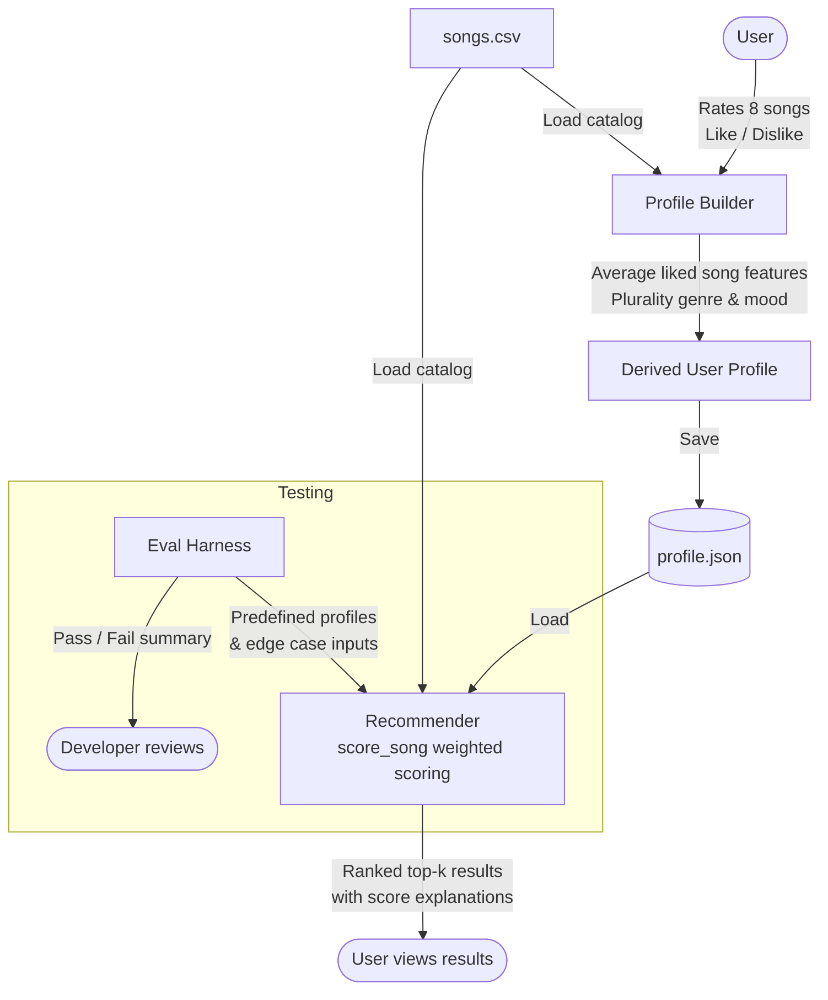

# Music Recommender — Applied AI System

> **Demo walkthrough (Loom):[link here](https://www.loom.com/share/bf19084106064101a984bf4645830a2e)

---

## Original Project

**Base project:** Music Recommender Simulation (Module 3)

The original project implemented a content-based music recommender that scored songs against a hard-coded user preference dictionary using weighted feature similarity across genre, mood, energy, valence, acousticness, and tempo. It ran entirely from the command line and required preferences to be manually edited in the source code. There was no way for a real user to generate their own profile.

---

## Title and Summary

**Music Recommender** is an interactive applied AI system that builds a personalized taste profile from a user's song ratings and uses it to recommend music. The user rates a series of randomly presented songs (like or dislike), the system derives their preferences from the aggregate of liked tracks, and then surfaces the top matching songs from the catalog with scored explanations for each recommendation.

This project demonstrates how a simple rule-based AI system can be made meaningfully interactive, testable, and trustworthy — without requiring a large model or external API.

---

## System Architecture



> Export this diagram as a PNG via [Mermaid Live Editor](https://mermaid.live) and save it to `/assets/architecture.png`.

---

## Setup Instructions

**Requirements:** Python 3.10+, pip

```bash
# 1. Clone the repo
git clone https://github.com/kartikwahlin/applied-ai-system-final.git
cd applied-ai-system-final

# 2. Create and activate a virtual environment
python3 -m venv .venv
source .venv/bin/activate      # Windows: .venv\Scripts\activate

# 3. Install dependencies
pip install -r requirements.txt

# 4. Run the Streamlit app
streamlit run src/app.py
```

The app opens at `http://localhost:8501`.

To run the eval harness:
```bash
python tests/eval_harness.py
```

To run the unit tests:
```bash
pytest
```

---

## Sample Interactions

### 1. High-energy music fan
**Input:** User likes Storm Runner (rock, intense, energy 0.91), Gym Hero (pop, intense, energy 0.93), and Altitude Rush (EDM, euphoric, energy 0.95).

**Derived profile:** genre=rock, mood=intense, energy=0.93, acousticness=0.06

**Top recommendation:** *Shatter the Sky* — Iron Veil
```
Score: 6.28
• genre match (+2.0)
• mood match (+1.5)
• energy proximity (+1.47)
• acousticness proximity (+0.94)
```

---

### 2. Chill study listener
**Input:** User likes Midnight Coding (lofi, chill), Library Rain (lofi, chill), and Spacewalk Thoughts (ambient, chill).

**Derived profile:** genre=lofi, mood=chill, energy=0.35, acousticness=0.83

**Top recommendation:** *Library Rain* — Paper Lanterns
```
Score: 6.41
• genre match (+2.0)
• mood match (+1.5)
• energy proximity (+1.49)
• acousticness proximity (+0.97)
```

---

### 3. No liked songs (guardrail case)
**Input:** User dislikes all 8 presented songs.

**Behavior:** System displays a warning — _"You didn't like any songs — using a default profile."_ — and falls back to a neutral pop/happy profile (energy=0.5) rather than crashing or returning empty results. Recommendations are still returned.

---

## Design Decisions

**Content-based filtering over collaborative filtering**
The catalog has 20 songs and no user history, so collaborative filtering ("users like you also liked...") is not viable. Weighted feature similarity is the right fit for the scale and data available.

**Profile derived from averages, not a model**
Averaging the numeric features of liked songs is transparent and deterministic — there is no black box. A teacher or student can trace exactly why a profile has a certain energy value. The trade-off is that this approach is sensitive to outliers (one very high-energy like pulls the average up).

**Streamlit over CLI**
The original project required manually editing source code to change profiles. Streamlit makes the rating flow accessible to any user and produces a demonstrable artifact. The trade-off is added infrastructure that isn't strictly necessary for the core algorithm.

**Profile saved to JSON**
Persisting the profile to `data/profiles/profile.json` means it survives page refreshes and can be inspected or shared. The alternative (session-only state) would require re-rating songs every time.

**Logging to file**
Every rating, profile derivation, and recommendation run is written to `recommender.log`. This makes it possible to audit what the system did without re-running it, which matters for a reliability-oriented design.

---

## Testing Summary

The eval harness (`tests/eval_harness.py`) runs 13 checks across three categories:

```
Invariants
  [PASS] Results are sorted descending by score
  [PASS] Genre match scores higher than genre mismatch
  [PASS] Mood match scores higher than mood mismatch
  [PASS] All scores are non-negative
  [PASS] Top result has the highest score in the catalog

Edge cases
  [PASS] Unknown genre returns k results
  [PASS] k larger than catalog returns all songs
  [PASS] Numeric-only profile returns results
  [PASS] Extreme energy values return results
  [PASS] Empty catalog returns empty list

Profile builder
  [PASS] Zero liked songs produces a valid fallback profile
  [PASS] Derived numeric fields are within [0, 1]
  [PASS] Plurality genre is selected correctly

========================================
  13/13 tests passed | baseline avg score: 1.45
========================================
```

**What worked:** All invariants and edge cases passed on the first run. The system handles unusual inputs (empty catalog, oversized k, unknown genre) gracefully without exceptions.

**What didn't:** The baseline average score of 1.45 reflects that most songs score low against a generic profile with no categorical matches — which is expected behavior, not a bug, but highlights that the recommender is heavily influenced by genre and mood alignment.

**What I learned:** Testing a deterministic system is less about "did it get the right answer" and more about verifying that structural guarantees hold under stress. The most useful tests were the edge cases, not the happy-path checks.

---

## Reflection

This project taught me that reliability in an AI system is less about the model and more about the structure around it — how inputs are validated, how failures are handled, and whether the system behaves predictably at its boundaries. A rule-based recommender with good guardrails is more trustworthy than a complex model with none.

It also showed how much UX matters. The original CLI version required editing source code to test a new profile. Wrapping the same algorithm in a simple rating interface made it feel like a real product. The intelligence of the system didn't change — only how a person could interact with it.
